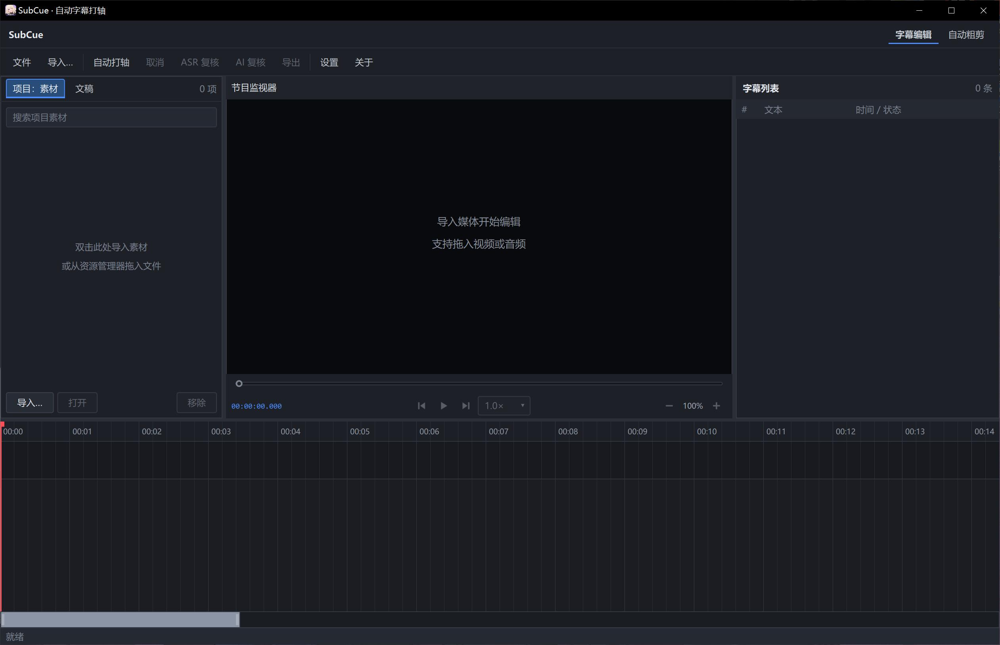
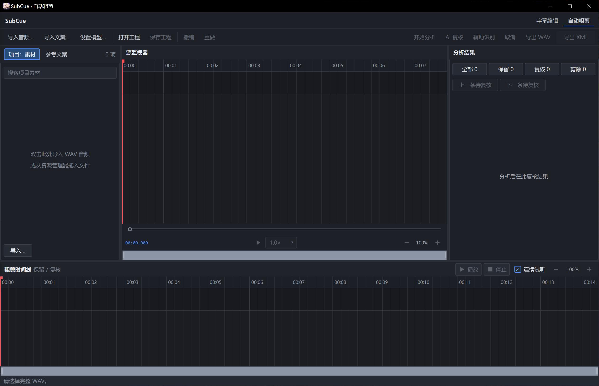

<p align="center">
  
</p>

<h1 align="center">SubCue</h1>

<p align="center">
  面向 Windows 的本地视频字幕打轴与音频粗剪工具<br>
  C++20 · Qt 6 / QML · FFmpeg · 可选 CUDA 本地推理
</p>

SubCue 提供两个工作区：

- **字幕编辑**：导入视频、音频和 TXT/SRT 文案，用 ASR 生成词级时间戳，人工校正后导出字幕。
- **自动粗剪**：根据完整旁白 WAV 与可选 TXT/DOCX 文案，识别重录、低置信度和可疑片段，生成可复核的非破坏性时间线，并导出 Premiere Pro 可读取的 FCP7 / xmeml XML。

没有可靠的真实音频证据时，SubCue 不会虚构时间，也不会自动删除无法确认的片段。REVIEW 片段会留在结果里；CUT 只表示不加入粗剪时间线，源音频始终可以恢复。

## 目录

- [功能](#功能)
- [界面](#界面)
- [安装](#安装)
- [注意事项](#注意事项)
- [使用](#使用)
- [测试与发布](#测试与发布)
- [项目结构](#项目结构)
- [设计约束与许可证](#设计约束与许可证)

## 功能

### 字幕编辑

- 支持视频、音频、TXT、SRT 拖放和导入。
- 三栏编辑界面：素材 / 文稿、节目监视器、字幕列表；底部是波形时间轴。
- 播放头、预览帧、字幕列表和时间轴双向同步。
- 字幕块可拖动、修剪、切开和吸附，支持撤销 / 重做。
- 支持逐帧移动、变速播放、入点 / 出点和字幕边界快捷编辑。
- 自动打轴显示阶段和进度，取消后保留已有结果。

### 自动粗剪

- 输入完整旁白 WAV，可选导入 TXT 或 DOCX 文案。
- 按录音顺序做文案匹配、ASR 对齐、重录检测和安全裁切判断。
- 支持 KEEP、REVIEW、CUT 筛选，以及逐片段人工决定、撤销和重做。
- 对可疑片段做辅助识别；识别失败或结果冲突时保守保留为 REVIEW。
- 粗剪工程保存为 `.subcue-roughcut`，包含分析版本、媒体 SHA-256、采样坐标、人工决定、理由和证据。
- 导出 FCP7 / xmeml XML，可在 Premiere Pro 中继续调整边界、滑移和恢复被禁用片段。

### AI 与本地推理

- ASR 可选云端 DashScope、本地 Qwen3-ASR 0.6B 或本地 Fun-ASR Nano。
- AI 复核统一使用阿里云百炼北京地域的 `qwen3.8-omni-flash`，只处理低置信度和可疑片段；语音时间戳仍由 ASR 产生。
- 本地 Qwen / Fun-ASR 运行在独立的 `SubCueInference.exe` 进程中，主程序不直接加载 Python 或 PyTorch。
- CUDA 为可选能力。模型保存在外置目录，不随源码或普通发布包自动下载、复制。

## 界面

**字幕编辑**：三栏工作区加底部波形时间轴，用来导入素材、打轴和校正字幕。



**自动粗剪**：导入完整旁白后分析、复核 KEEP / REVIEW / CUT，再导出 Premiere XML。



## 安装

**前置**：Windows 10/11 x64，Visual Studio MSVC x64 工具链，CMake 3.28+，Ninja，Qt 6.8+（当前预设为 Qt 6.10.3 MSVC 2022 x64），以及仓库内 `vcpkg_installed/x64-windows` 中的 FFmpeg。

普通字幕编辑和 CPU 构建不需要 Python，也不需要外部 `ffmpeg.exe`。本地 Qwen / Fun-ASR 另外需要 NVIDIA 独显（计算能力 ≥ 7.5）、CUDA Toolkit 13、`CUDA_PATH`，以及能跑 CUDA 12.4 的显卡驱动。已在 **RTX 3060 Ti 8GB** 上验证。

### 方式一：从源码构建

在 MSVC x64 Developer Prompt，或已加载 MSVC 环境的 PowerShell 中执行：

```bat
tools\build-windows.bat            # 默认 CUDA Release + 全量 CTest
tools\build-windows.bat release    # 无 CUDA / 不用本地推理
tools\build-windows.bat debug
tools\build-windows.bat cuda fresh # 工具链变更或缓存损坏时才需要 fresh
```

脚本默认使用 `C:\Qt\6.10.3\msvc2022_64`。Qt 不在该路径时，先设置 `Qt6_ROOT`。日常开发只保留 `out/build/windows-release-cuda`。

也可以直接使用 CMake 预设：`windows-debug`、`windows-release`、`windows-release-cuda`。

### 方式二：让 Agent 帮你装

把下面这段提示词发给任意一个能操作本机仓库的 Agent 会话：

```text
帮我安装 SubCue（Windows 本地字幕打轴与音频粗剪工具），步骤：
1. 检查本机 Visual Studio MSVC x64、CMake 3.28+、Ninja、Qt 6.8+（当前预设 C:\Qt\6.10.3\msvc2022_64）和仓库内 vcpkg_installed/x64-windows 的 FFmpeg；Qt 不在默认路径时设置 Qt6_ROOT。
2. 用 nvidia-smi 看显卡。AMD / Intel 核显，或 GTX 10 系等计算能力低于 7.5 的卡，不要走 CUDA 本地推理，改用 tools\build-windows.bat release，ASR 用云端 DashScope。GTX 16 系等非 RTX、但计算能力 ≥ 7.5 的卡可以本地推理，笔记本还要把 SubCueInference.exe 指定为 NVIDIA 独显（步骤见 README 注意事项）。
3. 在 MSVC x64 环境中于仓库根目录执行 tools\build-windows.bat（默认 CUDA Release）。无 CUDA 或不用本地推理时改执行 tools\build-windows.bat release。首次配置较慢，属正常。
4. 需要本地 ASR 时，确认 SUBCUE_MODELS_ROOT（本机默认 E:\AIModels\ASR\models），只允许执行 tools\setup-models.ps1 下载并校验模型；不要把权重复制进 models/、构建树或发布包，不要删除或覆盖已完整的模型。
5. CUDA 本地推理再执行 tools\setup-inference-env.ps1；本机 Python 不在默认 uv 路径时加 -Python。创建项目专用 .venv-inference，不要改系统 Python。脚本结束必须打印 cuda=True 和 GPU 名称。
6. 完成后用仓库根目录 SubCue.bat 启动；粗剪工作区可加 --roughcut-workspace。
遇到报错先查 https://github.com/BaoBaodesu/SubCue README 的注意事项和常见问题表。只修改项目级配置，不修改编辑器设置。
```

### 启动

```bat
SubCue.bat                          # CUDA Release
SubCue.bat --roughcut-workspace     # 直接进入自动粗剪
run-debug.bat                       # Debug
tools\run-release.bat               # CPU Release
```

### 本地模型（可选）

模型权重不在仓库里，由 `SUBCUE_MODELS_ROOT`、设置项 `modelsRoot` 或 CMake `SUBCUE_MODELS_ROOT` 解析，本机默认为 `E:\AIModels\ASR\models`。只允许用 `tools\setup-models.ps1` 下载；软件内不会自动下载模型。

```powershell
powershell -ExecutionPolicy Bypass -File tools\setup-models.ps1
powershell -ExecutionPolicy Bypass -File tools\setup-inference-env.ps1
# 本机 Python 不在默认 uv 路径时：
# powershell -ExecutionPolicy Bypass -File tools\setup-inference-env.ps1 -Python "C:\path\to\python.exe"
```

## 注意事项

### 显卡与本地推理

本地 Qwen3-ASR / Fun-ASR 只走 NVIDIA CUDA PyTorch（`torch==2.6.0+cu124`），主程序不加载 Python。CUDA 预设构建和打包还需要 **CUDA Toolkit 13**（随包 `cublas64_13.dll` 等）。CUDA 13 的最低架构是 **Turing，计算能力 7.5**。

| 显卡 | 怎么用 |
| --- | --- |
| RTX 20 / 30 / 40 / 50 系 | 默认路径：`tools\build-windows.bat` → `setup-inference-env.ps1` → `SubCue.bat`。已在 RTX 3060 Ti 8GB 验证。 |
| GTX 16 系等非 RTX、但计算能力 ≥ 7.5 | 可以本地推理，但必须做下面「非 RTX 额外步骤」。 |
| GTX 10 系、Maxwell、Volta（计算能力低于 7.5） | **不要**走 CUDA 本地推理。用 `tools\build-windows.bat release`，ASR 选云端 DashScope。 |
| AMD 独显 / Intel 核显 / 没有 NVIDIA | 同样走 CPU 构建 + 云端 DashScope。字幕编辑不需要 GPU。 |

**非 RTX（主要是 GTX 16 系笔记本）额外步骤：**

1. 打开终端执行 `nvidia-smi`，确认能看到 NVIDIA GPU；计算能力可在 NVIDIA 控制面板或 GPU 规格页核对，必须 ≥ 7.5。
2. Windows「设置 → 系统 → 显示 → 图形设置」，把 `SubCueInference.exe` 和 `.venv-inference\Scripts\python.exe` 设为「高性能 / NVIDIA」。不要让它们跑在核显上。
3. NVIDIA 控制面板 → 管理 3D 设置 → 首选图形处理器，选「高性能 NVIDIA 处理器」。
4. 安装支持 CUDA 12.4 的 Game Ready / Studio 驱动；CUDA 预设构建还要安装 CUDA Toolkit 13，并保证 `CUDA_PATH` 指向它。装完驱动后重启一次。
5. 再跑 `tools\setup-inference-env.ps1`。结束时应打印 `cuda=True` 和实际 GPU 名称；若是 `CUDA 不可用`，先重复第 2～4 步，不要改系统 Python。
6. 仍失败就改用云端 DashScope，不要为了过检测去覆盖 PyTorch wheel 或拷贝模型。

本地推理按 **8GB 显存** 设计：ASR 与 Forced Aligner 会串行装载，不会同时常驻。显存不够时先关掉游戏、浏览器硬件加速和其他占 GPU 的程序。

### 构建与运行

- 必须在 **MSVC x64** 环境里构建（Developer Prompt，或已调用 `vcvarsall.bat x64` 的 PowerShell）。不要用未加载 MSVC 的普通终端。
- 默认 Qt 路径是 `C:\Qt\6.10.3\msvc2022_64`，不对就设 `Qt6_ROOT`。
- `setup-inference-env.ps1` 默认 Python 是本机 uv 的 CPython 3.12。换机器时传入 `-Python`，或设置环境变量 / CMake `SUBCUE_PYTHON_ROOT`。
- 模型下载依赖 `uv` / `uvx`。不要把权重复制进 `models/`、构建树或发布包，也不要删除已完整的外置模型。
- 开发态请用仓库根目录的 `SubCue.bat` 启动，不要直接双击 `out\build\...\SubCue.exe`（缺少 Qt / FFmpeg / CUDA 的 PATH）。
- 日常只保留 `out/build/windows-release-cuda`。CPU / Debug 预设用完即删。`fresh` 只在工具链变更或缓存损坏时使用。

### 常见问题

| 现象 | 原因与解决 |
| --- | --- |
| `[SubCue] Missing ...\SubCue.exe` | 还没构建。先跑 `tools\build-windows.bat`，无 CUDA 则用 `release`。 |
| `Qt runtime not found` | 默认路径不是 `C:\Qt\6.10.3\msvc2022_64`。设置 `Qt6_ROOT` 后再构建 / 启动。 |
| `CUDA_PATH is not set` | 没装 CUDA Toolkit 13，或当前环境没导出该变量。要本地推理就装 Toolkit；否则改用 `tools\build-windows.bat release`。 |
| `CUDA is unavailable` / `torch.cuda.is_available()` 为 False | 核显抢设备、驱动过旧，或卡低于计算能力 7.5。先看「注意事项」里的显卡表和非 RTX 额外步骤。 |
| `CUDA 显存不足` | 按 8GB 设计。关掉其它占 GPU 的程序后重试，或改用云端 DashScope。 |
| 设置里显示「模型未安装或权重未完成」 | 外置模型目录不完整。只用 `tools\setup-models.ps1` 下载并校验，不要手工复制权重。 |
| 首次 `cmake --preset` 很慢 | 正常。配置成功后日常构建会复用 `out/build/windows-release-cuda`。 |
| 提示缺少 FFmpeg DLL | 确认仓库内存在 `vcpkg_installed/x64-windows`，并用 `SubCue.bat` 或 `tools\run-*.bat` 启动，不要直接双击未部署的 `SubCue.exe`。 |

## 使用

### 自动字幕打轴

1. 打开或拖入媒体文件。
2. 粘贴文案，或导入 UTF-8 TXT / SRT。
3. 在「设置」中配置并测试 ASR；如需 AI 复核，再保存百炼 API Key。
4. 点击「自动打轴」。
5. 检查低置信度、音频未检出和待确认片段，人工修正后导出。

### 自动粗剪

1. 切换到「自动粗剪」工作区。
2. 选择完整旁白 WAV，并可选导入 TXT / DOCX 文案。
3. 启动分析，等待 ASR、文案匹配、重录检测和时间线生成完成。
4. 检查 REVIEW 片段及证据，必要时运行辅助识别。
5. 设置人工 KEEP、REVIEW 或 CUT 决定。
6. 保存 `.subcue-roughcut` 工程并导出 FCP7 / xmeml XML。

用户设置在 `%APPDATA%\SubCue\settings.json`，日志在 `%APPDATA%\SubCue\logs\app.log`，API Key 存在 Windows Credential Manager。

## 测试与发布

```bat
ctest --preset windows-release-cuda --output-on-failure
ctest --preset windows-release-cuda -R SubCueRoughCutDecisionTests

tools\package-windows.bat          # 默认 CUDA 便携包 → dist/windows-x64-cuda
tools\package-windows.bat release  # CPU 便携包 → dist/windows-x64
```

便携包包含 Qt、FFmpeg 和 MSVC 运行库；CUDA 包还包含专用推理运行目录和 CUDA 运行时 DLL，但不包含模型权重。

## 项目结构

```text
SubCue/
├── src/app/          # 应用入口、控制器、QML 工作区与控件
├── src/core/         # 媒体、播放、ASR、对齐、字幕、AI、粗剪
├── src/inference/    # 独立 Python 推理 Worker 的 C++ 宿主
├── src/tools/        # 粗剪 XML 等命令行工具
├── tests/cpp/        # Qt Test / CTest 测试
├── tests/media/      # 测试媒体和文案样本
├── docs/             # 架构、粗剪验收、许可证与 README 配图
├── cmake/            # Windows 打包逻辑
└── tools/            # 构建、运行、模型和推理环境脚本
```

模块职责见 [`docs/architecture.md`](docs/architecture.md)，粗剪导出验收见 [`docs/roughcut-phase1-premiere-check.md`](docs/roughcut-phase1-premiere-check.md)。

## 设计约束与许可证

- ASR 只使用真实音频证据；对齐失败、识别冲突或证据不足时保持 REVIEW。
- 粗剪内部使用原 WAV 采样坐标，导出 XML 时才转换到帧时基。
- 背景任务必须可取消，并在应用退出或媒体切换时等待资源释放。
- 本地推理与主程序隔离，GPU 任务通过统一门禁串行执行。
- 不修改用户编辑器设置，不自动下载模型，不提交凭据、模型权重和构建产物。

Qt、FFmpeg 及其他第三方组件遵循其原有许可证。具体声明见 [`licenses/NOTICE.txt`](licenses/NOTICE.txt)、[`docs/third-party-licenses.md`](docs/third-party-licenses.md) 以及发布包中的 `licenses/` 目录。
